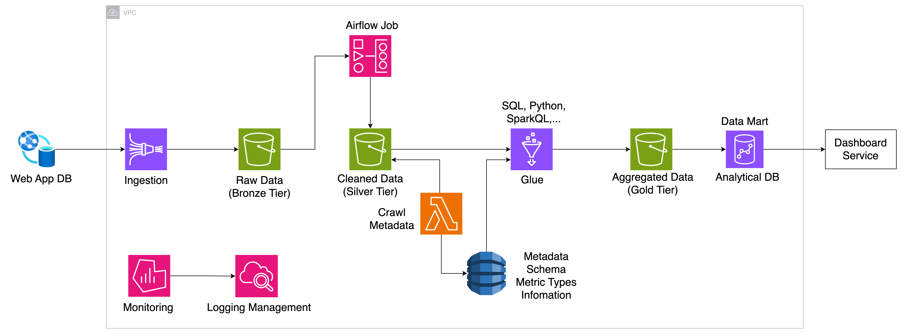

# gfg-technical-assignment

- This repository contains the code for the technical assignment given by Global Fashion Group.
- In this assignment, I have implemented a simple notebook to process and analyze data from the given JSON file.
- The notebook includes the following features:
    - Inspecting:
      - The sample data contains duplicate entries. But the duplicate entries are exactly the same.
      - 'is_newsletter_subscriber' is a boolean column, but it is represented as a string in the JSON file.
      - 'coupon_discount_applied' contains some null values
      - 'days_since_last_order' seems to be corrupted, as it is greater than 'days_since_first_order' and maximum value exceeds 142 years.
    - Cleaning
      - Data is cleaned using Pandas, which is suitable for small to medium-sized datasets.
      - If the dataset were larger, I would have used Spark.
    - Ingesting
        - The cleaned data is ingested into a self-host disposable Postgres database.
    - Analyzing: answering the questions in the assignment.
      - What was the total revenue to the nearest dollar for customers who have paid by credit card? 
      - What percentage of customers who have purchased female items have paid by credit card? 
      - What was the average revenue for customers who used either iOS, Android or Desktop? 
      - We want to run an email campaign promoting a new mens luxury brand. Can you provide a list of customers we should send to?
  
- For stage 4 - PRODUCTIONISATION, I would like to propose a solution using various services from AWS:
  - First, The data from web-app database will be ingested into an S3 raw bucket (Bronze Tier) using Kinesis Firehose.
  - Then, S3 bucket will trigger an event to EventBridge and send event to a Step Function.
    - Or we can setup a self-hosted Airflow to cut down the cost.
    - It will read the data from S3 bucket and clean it using python, pandas or PySpark.
    - Then, the cleaned data will be written to another S3 bucket (Silver Tier).
  - Next, A Glue job will be triggered to transform the data and write it to a Postgres database (Gold Tier).
    - Or we can use another DAG in Airflow to do the same.
    - The data will be transformed and aggregated to answer the questions in the assignment.
    - The transformed data will be written the final bucket (Gold Tier) and a analytical database acts as a datamart (Aurora, RDS, Clickhouse,...).
  - Finally, the data will be visualized in a dashboard.
  - In the process, we can setup Grafana and CloudWatch to monitor the data pipeline and alert us in case of any issues.
  - We can also setup a Glue job to crawl metadata and store it in a DynamoDB table.
  - This DynamoDB table can be used to store the metadata of the data pipeline and can be used to track the lineage of the data.
   
